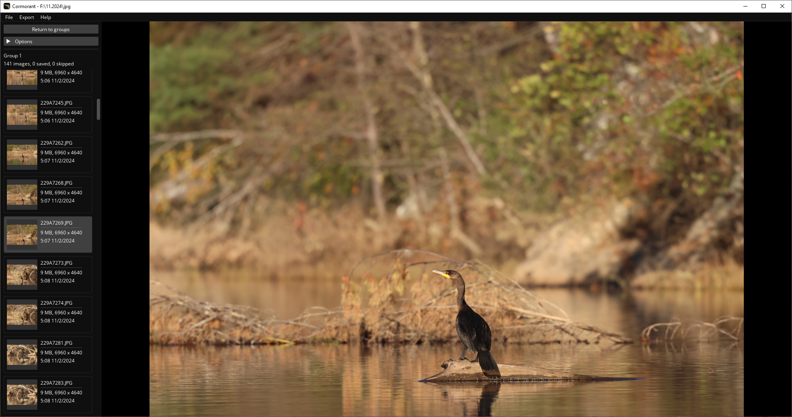

<div style="text-align: center">
    
</div>

---

Cormorant is an image filtering application designed for quickly finding the best subset of a large number of wildlife photos. In addition to being small and lightweight, Cormorant aims to make searching through images as efficient as possible without handing that work to an automated system.

### Features

**Automated image grouping**: Images are placed into groups, which are generated based on user-configurable parameters. For example, setting the **time** parameter to 10 seconds will create groups where all images within the group were taken within 10 seconds of the next and previous image.

**Image compare**: Images within a group can be compared side by side, with pan and zoom operations happening together or independently. When an image is marked as skipped, the next available image is loaded in its place at the same zoom/pan position.

**Key bindings**: All repetitive UI buttons have a corresponding key binding. This means your hands do not need to move between a trackpad/mouse and the keyboard when quickly flipping through images.

## Screenshots




## Downloads

See [Releases](https://github.com/SkylerRankin/cormorant/releases) to download pre-built binaries.

## Building from source

Cormorant uses CMake and requires a compiler supporting C++ 20 (tested on MSVC 19.34 and Clang 18.1.3). The files are split between a `src` directory for source code, and a `lib` directory for dependencies, which either have their source copied into this repository or are fetched from their active git repository.

Additional dependencies may be needed to build GLFW on Linux. See [Installing dependencies](https://www.glfw.org/docs/3.3/compile.html#compile_deps) for specifics.

```
git clone git@github.com:SkylerRankin/cormorant.git
mkdir cormorant/build
cd cormorant/build
cmake ..
cmake --build .
```

The following libraries are used:
* **Dear ImGui**: For UI widgets.
* **FreeType**: For better text rendering in Dear ImGui.
* **GLAD**: For OpenGL function bindings.
* **GLFW**: For handling windows, input, and the OpenGL context.
* **glm**: For vector and matrix math operations.
* **stb_image**: For decoding and resizing JPGs.
* **TinyEXIF**: For parsing EXIF metadata from images.
* **TinyFileDialogs**: For opening a native directory picker.
* **TinyXML-2**: For parsing EXIF metadata that contains XML.
* **whereami**: For finding the executable directory across platforms.
