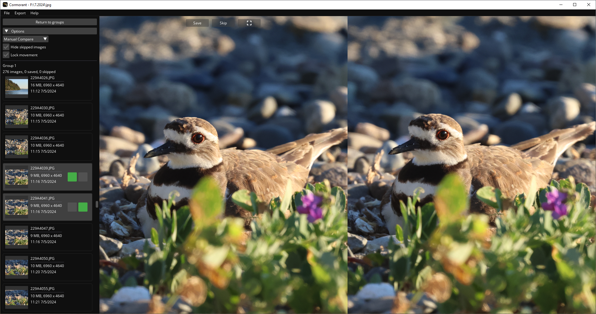

<div style="text-align: center">
    
</div>

---

Cormorant is an image filtering application designed for quickly finding the best subset of a large number of wildlife photos. In addition to being small and lightweight, Cormorant aims to make searching through images as efficient as possible without handing that work to an automated system.

The Cormorant workflow is based on utilizing small image groups. You first select a directory containing the images to be culled, usually JPGs and some sort of RAW files. Next, you choose the group parameters and let Cormorant generate the image groups. Ideally, each group contains photos that are similar enough that only one needs to be saved. For instance, a group might contain 20 images of a bird taken within a few seconds. It's common that just one of these is worth keeping, given the rest may be nearly identical. With the groups generated, you can then go through each group, find the best image (or multiple best images), and finally export the saved images to a new directory.

When searching for the images worth keeping, large groups makes progress slow. It becomes easy to repeat comparisons or do unnecessary comparisons between images. With small image groups, you can be sure that the number of images within a group worth keeping is small, and nothing of value was skipped over. You can also find the best image in a single linear search using the compare view, rather than potentially checking every pair.

### Features

**Automated image grouping**: Images are placed into groups, which are generated based on user-configurable parameters. For example, setting the **time** parameter to 10 seconds will create groups where all images within the group were taken within 10 seconds of the next and previous image.

**Image compare**: Images within a group can be compared side by side, with pan and zoom operations happening together or independently. When an image is marked as skipped, the next available image is loaded in its place at the same zoom/pan position.

**Key bindings**: All repetitive UI buttons have a corresponding key binding. This means your hands do not need to move between a trackpad/mouse and the keyboard when quickly flipping through images.

## Screenshots




## Downloads

*Binaries for Windows will be added soon.*

## Building from source

Cormorant uses CMake and requires a compiler supporting C++ 20 (tested on MSVC 19.34). The files are split between a `src` directory for source code, and a `lib` directory for dependencies, which either have their source copied into this repository or are fetched from their active git repository.

```
git clone git@github.com:SkylerRankin/cormorant.git
mkdir cormorant/build
cd cormorant/build
cmake ..
```

The following libraries are used:
* **GLFW**: For handling windows, input, and the OpenGL context.
* **GLAD**: For OpenGL function bindings.
* **FreeType**: For better text rendering in Dear ImGui.
* **Dear ImGui**: For UI widgets.
* **TinyFileDialogs**: For opening a native directory picker.
* **stb_image**: For decoding and resizing JPGs.
* **glm**: For vector and matrix math operations.
* **TinyEXIF**: For parsing EXIF metadata from images.
* **TinyXML-2**: For parsing EXIF metadata that contains XML.

